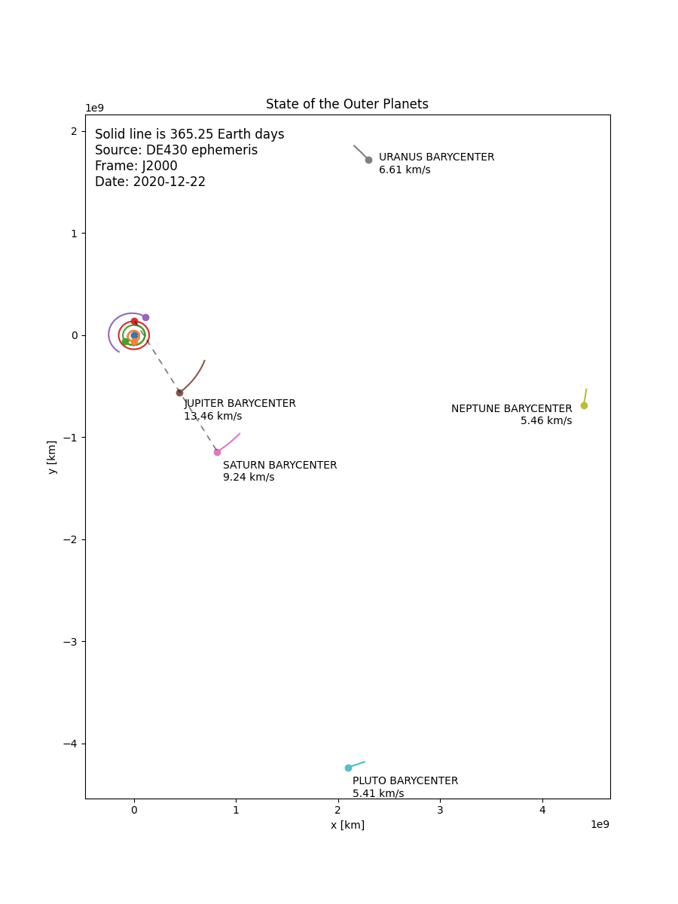
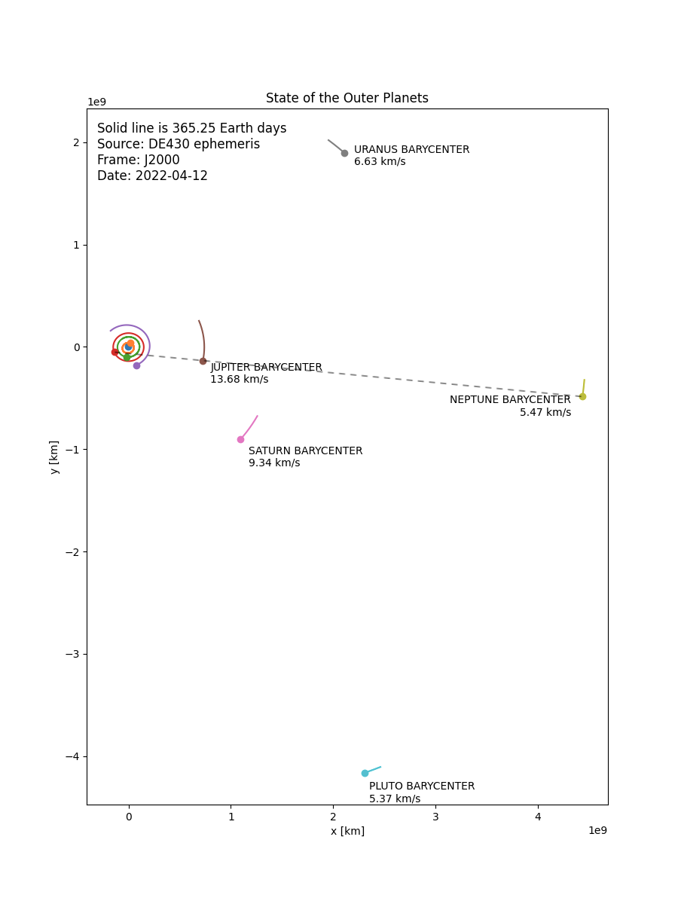
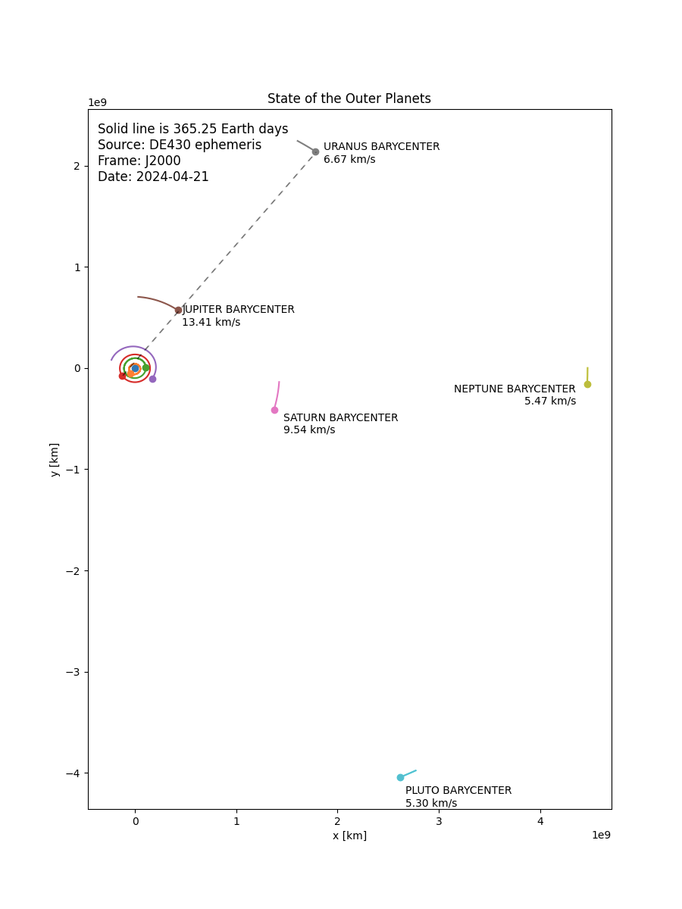

# Jupiter Conjunctions

Today (2020-12-22 UTC), Jupiter and Saturn had a conjunction. Some other
interesting conjunctions will happen around the following dates:

* 2020-12-22 Jupiter--Saturn
* 2022-04-12 Jupiter--Neptune
* 2024-04-21 Jupiter--Uranus

These results were obtained by visually looking for straight lines between
Earth, Jupiter, and some other planet, while setting a proposed time in TDB
seconds past J2000 in the `/outer_planets.png/<et>` endpoint